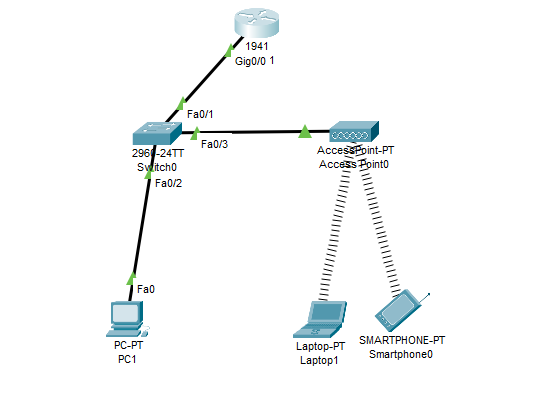
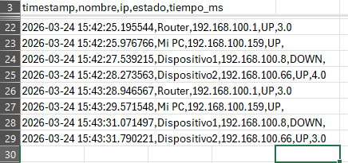
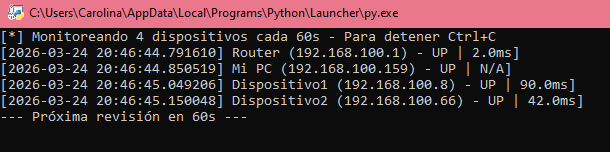

# Network-Monitor

## Overview
Automated network monitoring tool that tracks device availability and response times across a home network. Built with Python, it continuosly pings devices every 60 seconds, logs results with timestamps, and stores historical data for analysis.

## Technologies Used
- **Python** - Monitoring automation and data logging
- **Cisco Packet Tracer** - Network topoly design and simulation
- **CSV** - Lightweght data storage for historical records

## Network Topology
Home network with 4 devices monitored:
- **Router WiFi** - 192.168.1.1
- **PC** - 192.168.1.2
- **Disp1** - 192.168.1.3
- **Disp2** - 192.168.1.4

## Key Features
- Automated ping monitoring every 60 seconds
- Tracks device status (UP/DOWN) and response time in ms
- Timestamp logging to CSV for historical analysis
- Easily configurable device list

## How to Run
1. Clone the repository
2. Edit the `DISP` list in `network_monitor.py` with your device IPs
3. Run the script:
 ```bash
python network_monitor.py
```
## Screenshots






